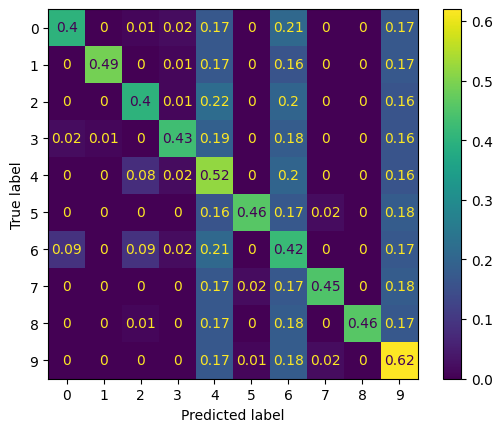
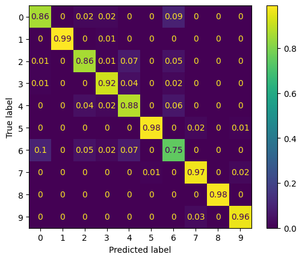
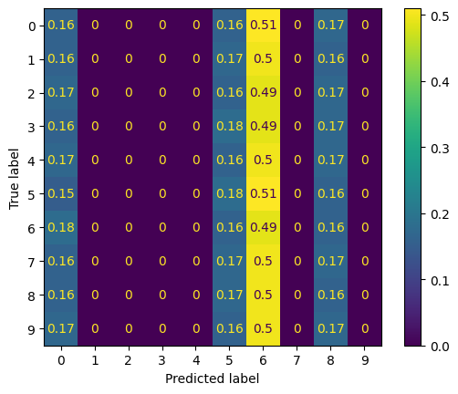

# ECEN 758 Group 31 Project
## Abstract
The goal of this project is to explore the [FashionMNIST](https://github.com/zalandoresearch/fashion-mnist) dataset, and build a data mining pipeline starting from data cleansing to classification. 
We first applied dimensionality reduction technique to better visualize the distribution of data, and also find potential pattern that can help deciding our choice of model and learning method.
We picked [squeezenet](https://pytorch.org/hub/pytorch_vision_squeezenet/) as our model. By leveraging cross validation and multiple experiments we have obtained the best hyperparameters to train our model and the resulting prediction can reach 92.4% accuracy on the testing set.
## Dataset
As its name suggested, the FashionMNIST dataset is highly inspired by the original [MNIST](https://www.tensorflow.org/datasets/catalog/mnist) dataset, which consists of images of hand-written numbers ranging from 0 to 9.
Like the MNIST dataset, ten classes of grayscale images are included. Unlike the MNIST dataset, the ten classes represent ten different apparels where much more complicated detailed must be learned in order to achieve great accuracy when classifying.
### Why FashionMNIST?
There are two main reasons why researching FashionMNIST might be more favorable comparing to keep using MNIST:
* The MNIST dataset is too easy for most of mordern large models, for example, CNN can reach 99.7% on MNIST with reasonable optimization
* The MNIST is not siutable for some state-of-the-art CV technique, some method might work well on MNIST but does not transfer to real CV data.
  
### A Quick Overview on FashionMNIST 
As mentioned above, FashionMNIST consists of ten classes of apperals, labeled 0~9 corresponding to:
**T-shirt/top, Trouser, Pullover, Dress, Coat,Sandal, Shirt, Sneaker, Bag, Ankle boot.**

And the dataset is separated into two sets, training set and testing set, consists of 60000 and 10000 images respectively. The dataset is balanced among all classed, where 6000 images for each class in the training set, and 1000 images for each class in the testing set.

Here are some example image from FashionMNIST

### Dimensionality Reduction 
All the images are all flattend into one vector of size 784, with each pixel represening one dimension. The grayscale value of each pixel is treated as one feature. Thus the shape of resulting dataset becomes (784,60000) . We applied both PCA and t-SNE on the training set, with the vision to finding out if there is any underlying pattern among classes.
#### PCA 
Here are the visualization of the resulting dataset in 3-D vector space via different view angle.

#### t-SNE
And here are the results of t-SNE with different perplexity p = 3,20,50,100

#### Observation from Dimensionality Reduction
It is quite astonishing that at the first thought, one may think that flattening images and representing feature as grayscale value do not make to much sence, for the spatial imformation may be severly harmed during the flattened process. 
Yet the resulting scatter plot shows quite the opposite. Althouhg not perfectly separable, we can still recognize the existence of clustering of same class.
Also by t-SNE, observation can be made to predict that some class may be more difficult to distinguish from others. For instance, class 6 (shirts) cannot be well linearly separated from the ”shirts cluster” (class 0, 2, 3, 4). Thus, we can be reasonably expected that this sub region perform worse than the other.
classes.

## Classification
### Model Selection
When it comes to model selection, there are two main factors that have to be considered: Model Capability and Efficiency.
There are four candidate: WideResNet50v2, VGG11, DenseNet121 and SqueezeNet1_0. According to the documentation of FashionMNIST, they all have similar performance in term fo accuracy.

(A general Structure of SqueezeNet)

As for the effectiveness,  the squeezeNet has the least amount of variables, thus acheiving the best training efficiency among the options. Thus we pick squeezeNet as our backbone model.
### Optimization 
The Adam and RMSProp optimizers were pit against each other with different learning rates to fine tune for the best possible model that can be used for this application. The fine tuning method used is 6-fold cross validation. 6 different models set to each possible combination of hyperparameters is used in the algrorithm, and test accuracy is used for the scoring.

### Result
In the end, the SqueezeNet model is trained with the Adam optimizer at 0.001 learning rate. This produced an accuracy of 92.49%. While below average compared with the recorded scores for the models provided in the FashionMNIST site, the model performed very well for all classes except for class 6, the shirts class. This class is often confused as a T-Shirt, pullover, dress, or coat 23% of the time. And we actually predict this in the data exploration section, where class 6 widely spreads among class 0 and class 4.

### Conclusion
We developed a classifier to categorize the FashionMNIST dataset. After selecting a baseline model, we fine tuned it and got above 90 accuracy. The majority of classifications are correct except for the shirt class, which is also supported by the PCA and T-SNE analysis. Developing models with better separability for specific cases in this dataset would be possible grounds for further work.

